The **Web Dashboard** is Scion's browser-based control plane. It complements the CLI
with a visual interface for creating and monitoring agents, managing projects, editing
harness configurations, and administering the Hub — all backed by real-time updates
over Server-Sent Events (SSE).

The dashboard is served by the combo server in [Workstation Mode](/scion/workstation/workstation-server/).
Everything on this page is single-binary: the Go `scion` server serves the compiled
client assets and handles OAuth, sessions, SSE, and API routing. The browser never
handles raw API keys or long-lived tokens directly — the server proxies API calls and
injects credentials server-side.

## Accessing the dashboard

Start the combo server and open the printed URL:

```bash
scion server start
```

The server logs the Web UI address on startup (defaulting to `http://127.0.0.1:8080`):

```
Scion server ready (workstation mode)
Web UI: http://127.0.0.1:8080
```

On a fresh install, your first visit lands on the **Onboarding Wizard**, a six-step
guided setup that captures your identity, verifies your environment (git, container
runtime, config), selects a runtime, and seeds the default harness configurations.

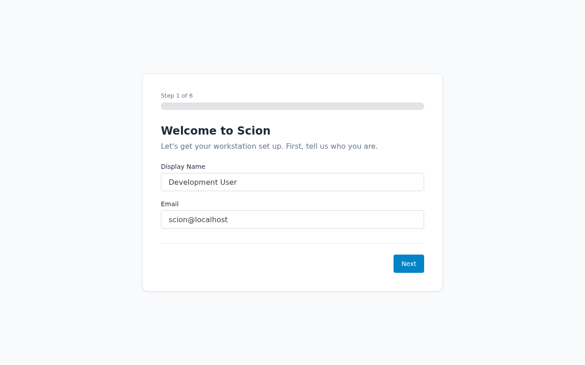

:::note[Container runtime required]
Agents run inside containers, so the onboarding **System Check** requires a supported
runtime (Docker or Podman). Until one is detected, the wizard cannot advance past the
system-check step and agents cannot start. Install Docker or Podman before onboarding.
:::

## Navigation overview

The dashboard uses a persistent left **sidebar** plus a top bar. The sidebar is
grouped into three sections:

- **Overview** — the Dashboard home.
- **Management** — Projects, Agents, Brokers, Skills, and Metrics.
- **Admin** — Hub Resources, Server Config, Integrations, Scheduler, Users, Groups,
  Maintenance, and Skill Registries. This section is only visible to users with the
  `admin` role.

The top bar carries the page title, the **Inbox** and **Notifications** trays, a help
button, a light/dark theme toggle, a link to your **Profile**, and **Sign out**. A
**Collapse** control at the bottom of the sidebar narrows it to icons for more screen
space.

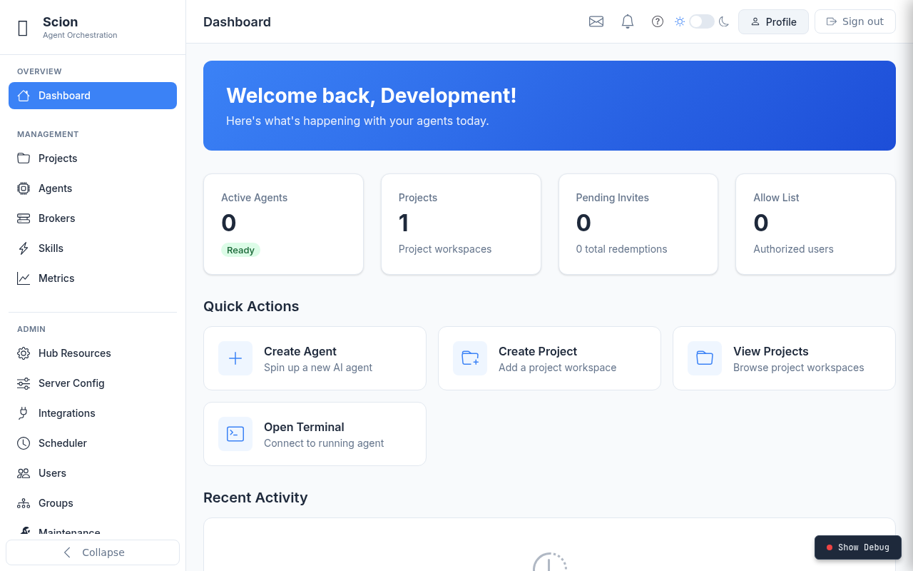

### Notifications & alerts

Scion delivers agent events to the browser in real time over SSE:

- **Inbox tray** — a centralized view of persistent messages sent by your agents, with
  unread badges and mark-as-read actions, for items that need human input.
- **Notifications tray** — agent-scoped status events, filterable directly from the top
  navigation.
- **Browser push notifications** — opt-in native notifications so you receive alerts
  even when the dashboard is in the background. You enable these from
  [Profile → Notifications & Settings](#profile--integrations); default triggers
  include `stalled`, `error`, and requests for user input.

## Dashboard home

The home page summarizes your workspace at a glance: stat cards for **Active Agents**,
**Projects**, **Pending Invites**, and **Allow List**; a **Quick Actions** grid
(Create Agent, Create Project, View Projects, Open Terminal); and a **Recent Activity**
feed.

## Projects

A **Project** is a workspace that agents run against. The **Projects** page lists every
project you can see, with filters (All / Mine / Shared), a grid/list view toggle, and a
**New Project** button.

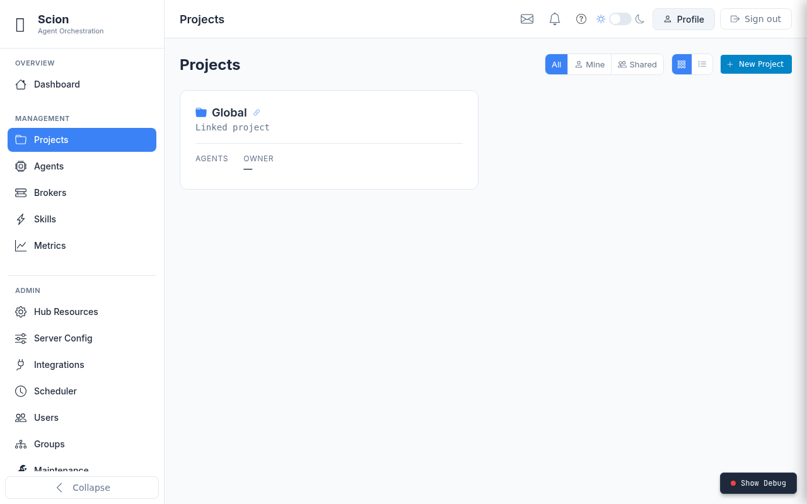

### Creating a project

**New Project** opens a form where you choose a **Workspace Type**:

- **Hub-managed Workspace** — a workspace managed by the Hub; no git repository
  required.
- **Git Repository** — connect a remote git repository.
- **Local Directory (linked)** — link an existing directory on the machine.

You also set the **Name**, a URL-safe **Slug** (auto-derived from the name), and
**Visibility** (Private / Team / Public).

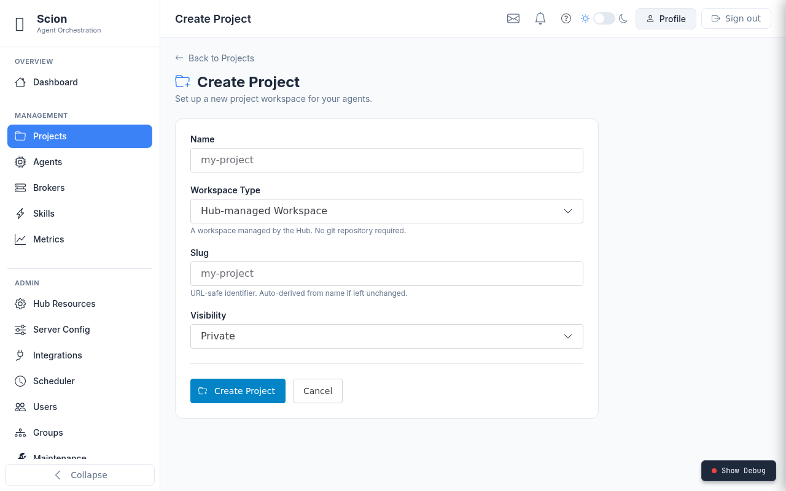

:::note[Hub-managed vs Linked]
For the differences between Hub-managed and git-backed (linked) projects, see
[Projects (Hub-managed vs Linked)](/scion/workstation/git-projects/).
:::

### Project detail

A project's detail page shows its type, agent/running counts, and created/updated
timestamps, with actions to create a **New Agent**, open **Metrics**, or open
**Settings**. Below the header, the **Agents** list (with a grid/list toggle) shows the
agents that belong to the project, followed by **Messages** and **Files** sections.

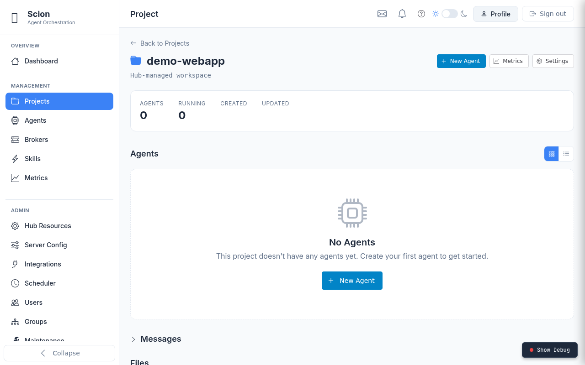

The **Files** browser lets you view and edit workspace files inline (with Markdown
preview), filter by fuzzy or regex search, and download individual files or a ZIP
archive of the project.

### Project settings

**Settings** is a tabbed configuration surface — **General**, **Limits**,
**Resources**, and **Runtime Brokers**. The General tab sets agent defaults for the
project: default template, default harness config, default model, default thinking
level, and telemetry. The Resources tab manages project-scoped environment variables
and secrets, including **injection mode** (Always vs. As-Needed).

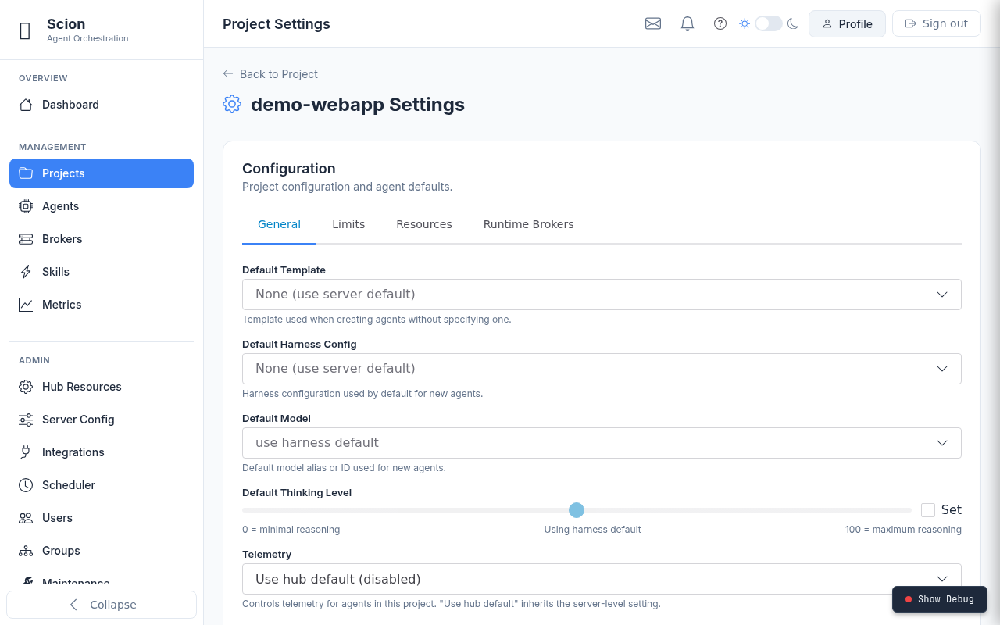

## Agents

The **Agents** page lists every agent with status filters (All / Running / Stopped /
Suspended / Error), a label filter, a sort control, and a grid/list toggle. Each agent
card shows its project, template, and broker, plus inline lifecycle actions.

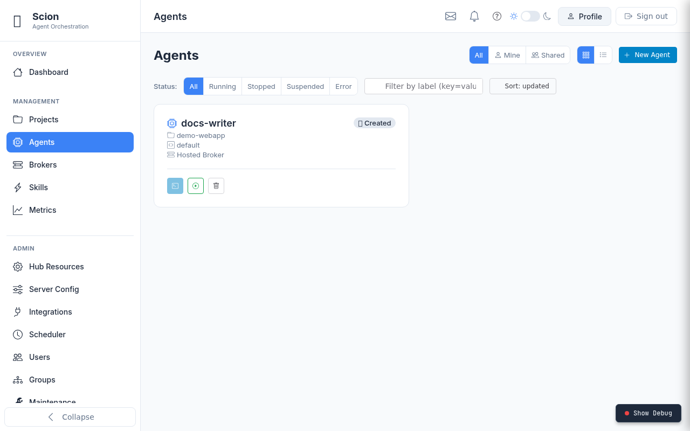

### Creating an agent

**New Agent** opens the Just-In-Time (JIT) creation form for granular, per-agent
configuration:

- **Agent Name**, **Project**, and **Template**.
- **Harness Config** — the LLM harness the agent runs (e.g. `gemini-cli`, `claude`).
- **Harness Authentication** — override the harness auth method (Auto Detected, Vertex
  Model Garden, or a harness credential file).
- **Runtime Broker** — the compute node that will run the agent. A **Runtime Profile**
  selector dynamically populates available profiles for the selected broker.
- **GCP Identity** — control whether the agent can obtain GCP identity tokens.
- **Initial Task** — the prompt the agent starts with.
- **Labels** — optional key-value pairs to organize agents.

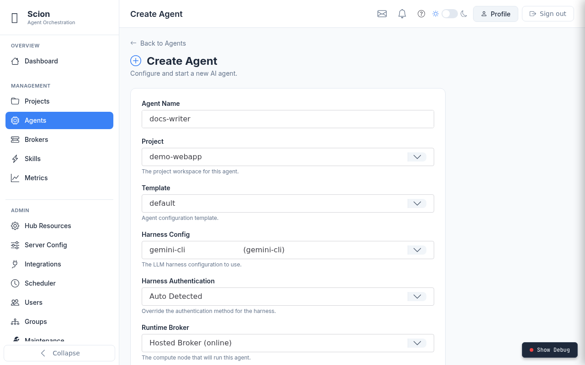

The form finishes with three choices: **Create & Edit** (persist the agent in the
`created` phase and open its config editor without launching), **Create & Start Agent**
(create and immediately dispatch to the broker), or **Cancel**.

### Agent detail

An agent's detail page has a header — name, current phase badge, and chips for
template, project, and broker — with **Terminal**, **Start**, **Configure**, and delete
actions. Below the header is a tabbed layout.

**Status** shows the live phase (Starting, Thinking, Waiting, Suspended, Error, …) and
activity, plus connectivity (last-seen heartbeat) and per-agent notifications. Scion
flags agents that are alive but hung (activity `stalled`) and those whose heartbeat has
gone silent (activity `offline`). A crashed agent (non-zero exit) appears in the
`error` phase and can be restarted from here.

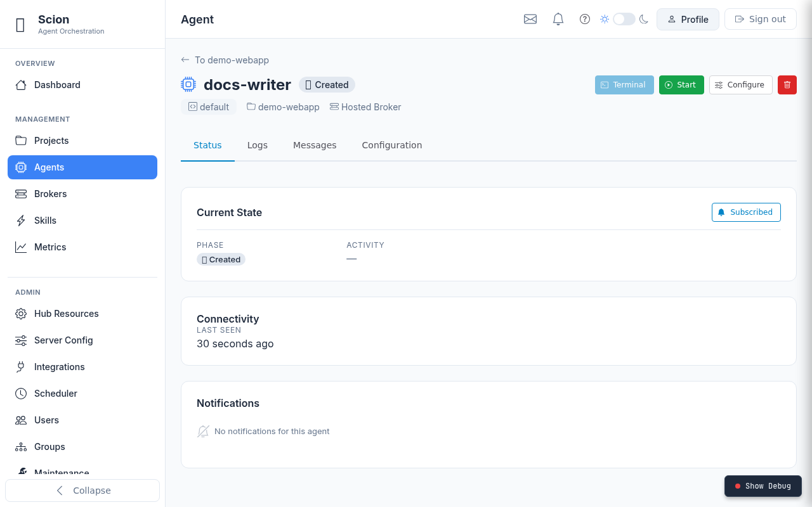

The remaining tabs are:

- **Logs** — streamed container logs via the integrated log viewer.
- **Messages** — structured messages sent to and from the agent.
- **Configuration** — the applied configuration: identity, harness & model, and runtime
  environment (including the resolved container image).

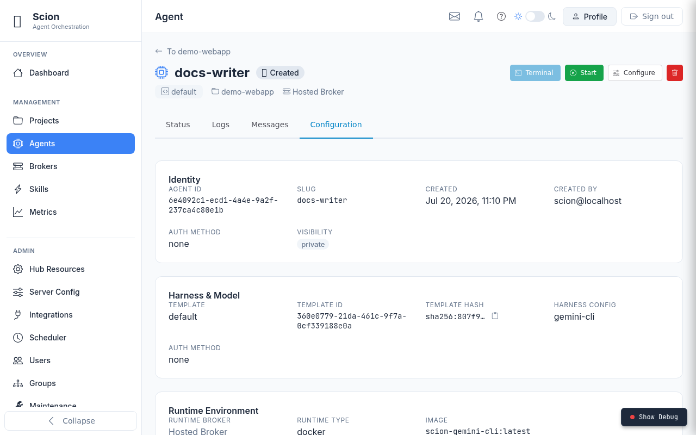

A collapsible **Debug** panel (bottom-right on every page) streams raw SSE events and
state transitions for troubleshooting.

### Terminal

The **Terminal** gives interactive, in-browser shell access to a running agent's
workspace, with full Tmux support — window switching (agent/shell), automatic resize,
extended key sequences (like `Shift+Enter`), and modifier-based text selection. The
terminal is only available once the agent has started; before that it shows an
unavailable state with a **Retry** control.

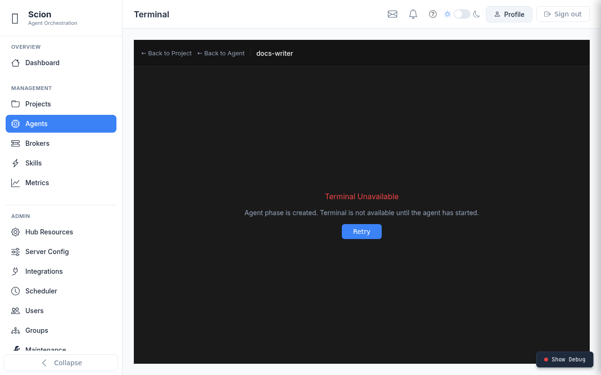

For configuration details, see [Interactive Sessions with Tmux](/scion/local/tmux/).

### Lifecycle controls

From the agent list or detail page you can **start**, **stop**, **suspend**,
**restart**, or **delete** an agent:

- **Suspend** preserves the harness session so a later **start** *continues* the
  conversation rather than starting fresh.
- **Restart** on a crashed (`error`) agent runs a clean session.
- To reclaim resources, the Hub **auto-suspends** agents that stay stalled past a grace
  period; they resume automatically on the next message.

Bulk operations (such as **Stop All** within a project) are available for efficient
shutdown. See [Agent Lifecycle](/scion/local/agent-lifecycle/) for the full state model.

## Runtime Brokers

The **Brokers** page monitors the compute nodes where agents execute. Each broker card
shows its status (online/offline), version, advertised capabilities (e.g. WebPTY,
Sync, Attach), last heartbeat, and the number of runtime profiles it offers.

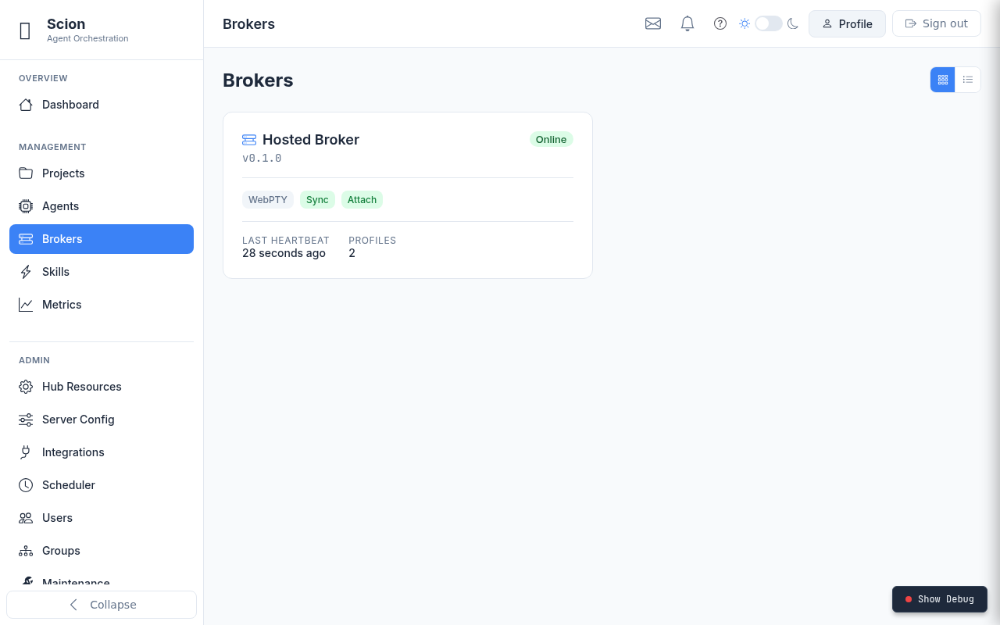

## Harness configuration

A **harness config** is the bundle of files that tells Scion how to drive a particular
agent harness. Global harness configs live under **Admin → Hub Resources → Harness
Configs**; projects can also define their own.

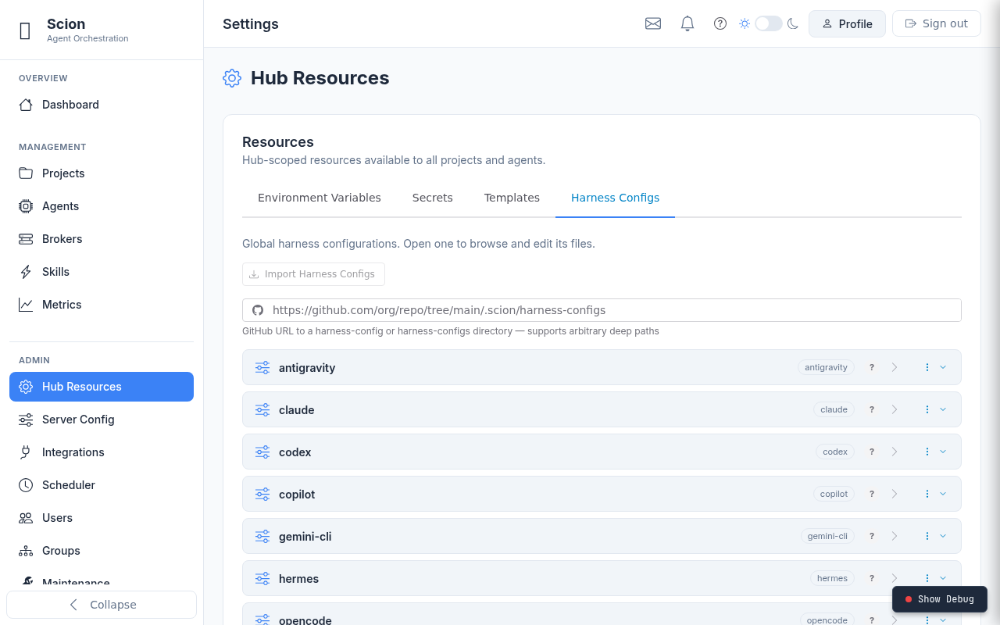

Opening a harness config shows its scope, status, and content hash, and lets you browse
and edit its files inline (create, edit, download, upload, delete), filter files, and
inspect the container **Images** (registry / local build / pulled) with **Pull Latest**
and **Re-check** actions.

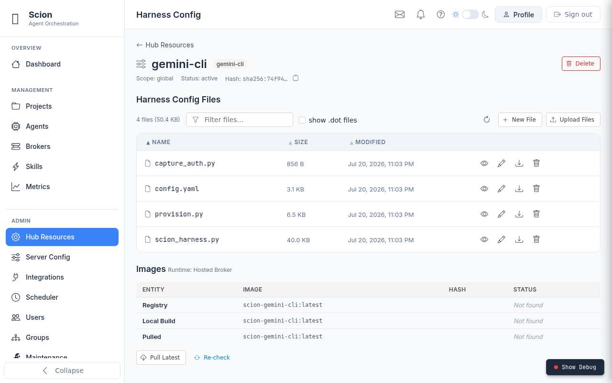

:::note[Harnesses are not plugins]
Harnesses are external, vendor-supplied agent programs that Scion drives via a
harness-config — they are not Go plugins. See [Supported Harnesses](/scion/supported-harnesses/).
:::

## Skills

**Skills** are reusable capabilities you can attach to agents. The Skills page offers
search, scope filtering, sorting, a grid/list toggle, and a **Create Skill** action.
Skills are sourced from **Skill Registries** (see the [Admin section](#admin-section)).

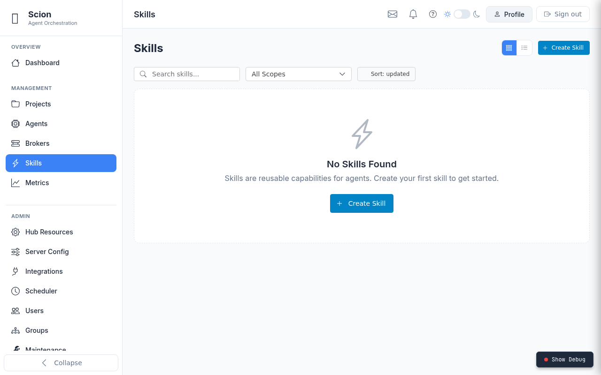

## Profile & integrations

The **Profile** area (top-right **Profile** link) has its own sidebar and covers your
personal settings and integrations:

- **Environment Variables** and **Secrets** — user-scoped values injected into your
  agents.
- **Access Tokens** — create and revoke personal API tokens for CLI/programmatic access.
- **Notifications & Settings** — enable browser push notifications and manage your
  notification subscriptions (scope, target, and trigger events such as `COMPLETED`,
  `WAITING_FOR_INPUT`, `LIMITS_EXCEEDED`, `STALLED`, and `ERROR`).
- **Telegram** (and **Discord**) — link a chat account to receive notifications and
  interact with agents.

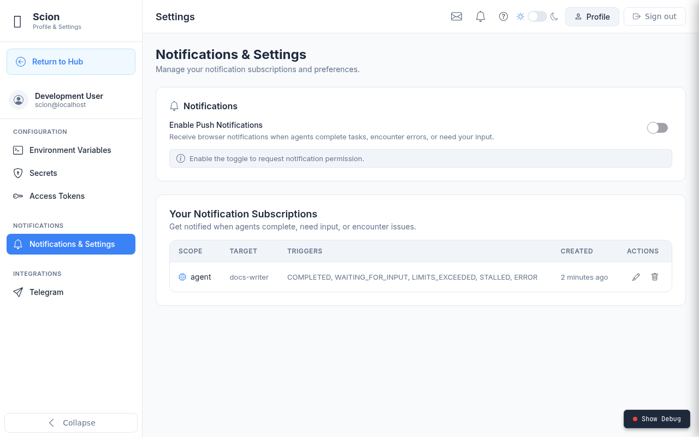

### Access tokens

Generate personal access tokens for authenticating the CLI or scripts against the Hub.
Tokens are shown once at creation — copy them immediately.

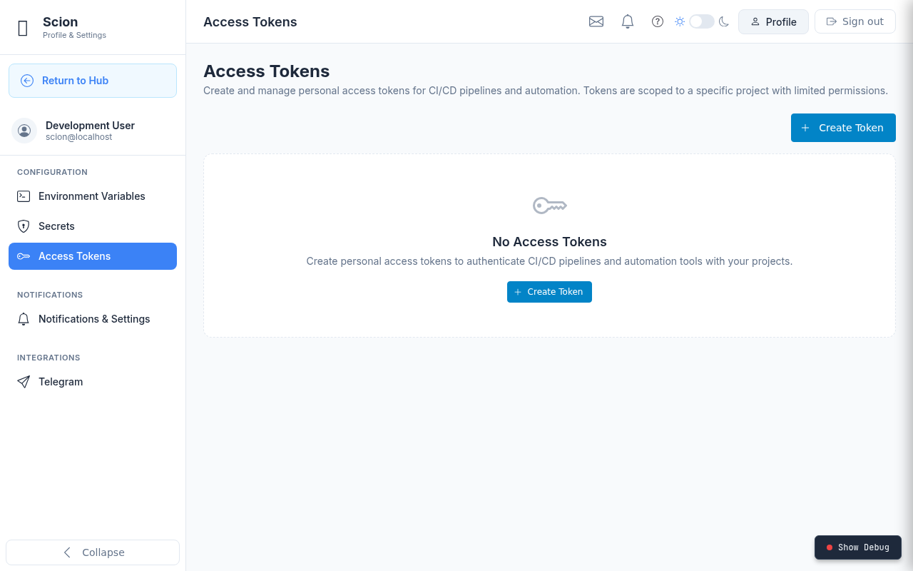

### Linking Telegram

The **Telegram** page walks you through linking: scan the QR code (or open the
registration link), message the Scion bot, send `/register`, and enter the six-character
code to complete the link.

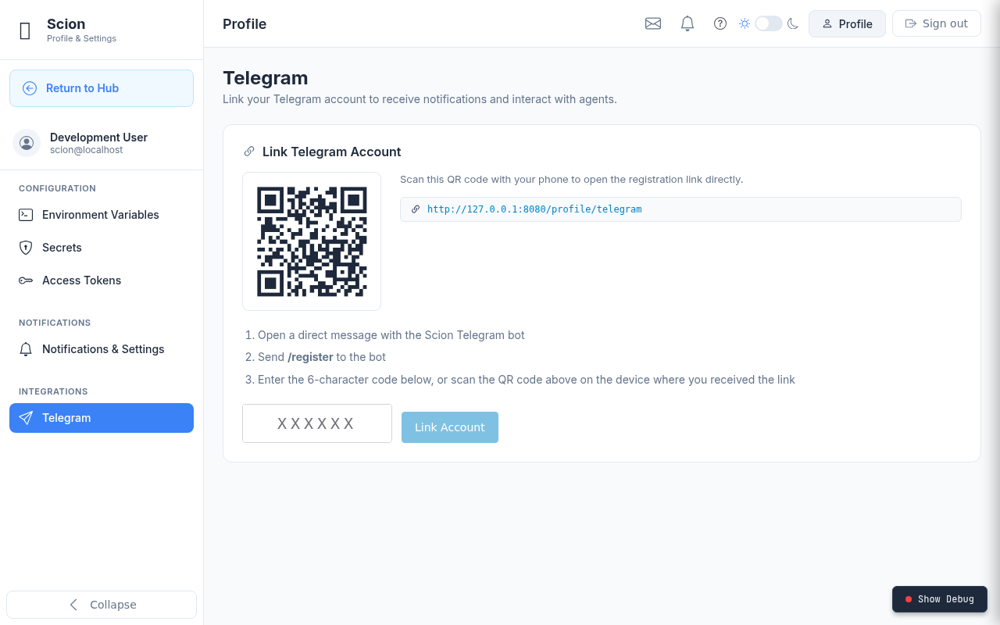

## Admin section

The **Admin** sidebar section is available to `admin` users and centralizes Hub
administration.

### Server config

**Server Config** edits the global server settings (`settings.yaml`) across tabbed
groups — **General**, **Hub Server**, **Runtime Broker**, **Data & Storage**,
**Authentication**, **Telemetry**, **GitHub App**, and **GCP Identity**. It also shows
the running server version, git commit, and build time, with a **Check for Updates**
action. Some changes take effect immediately; others require a server restart.

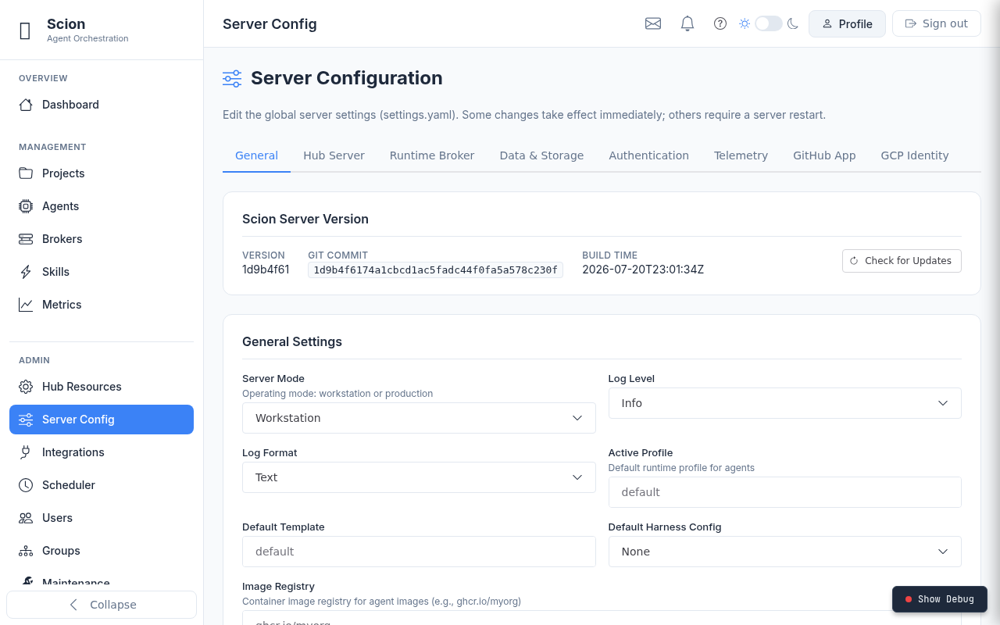

### Users & groups

**Users** lists accounts with role, status, last login, and creation time, split across
**Users**, **Members**, and **All Invites** tabs. **Groups** manages organizational
groups for policy-based authorization.

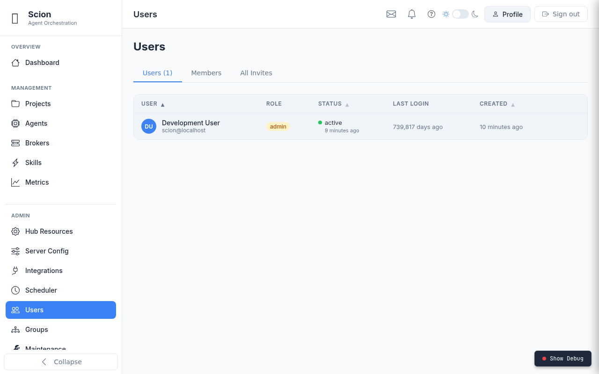

### Integrations

**Integrations** manages chat integrations — Telegram, Discord, Google Chat, and Slack
plugins — connected to the Hub. Integrations appear here once a broker plugin is
registered.

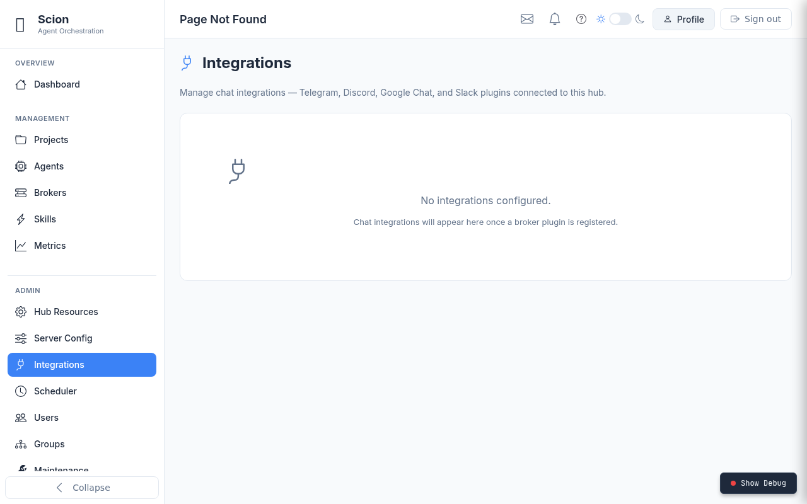

### Skill registries

**Skill Registries** configures the sources that supply skills to the Hub. Registries
can be added with **Create Registry**.

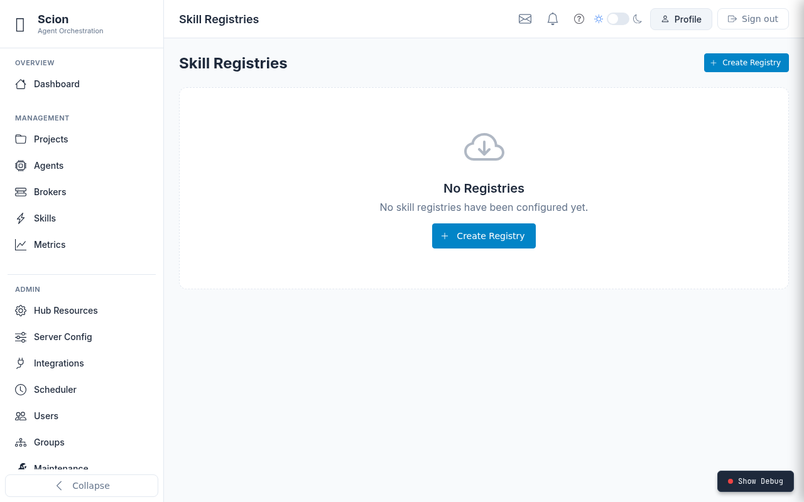

### Scheduler

**Scheduler** exposes the Hub's internal task scheduler: an overview (tick count, tick
interval, active timers, recurring tasks) plus the registered **Recurring Handlers**
(such as `agent-heartbeat-timeout`, `agent-stalled-detection`, and `schedule-evaluator`)
and **Event Handlers**.

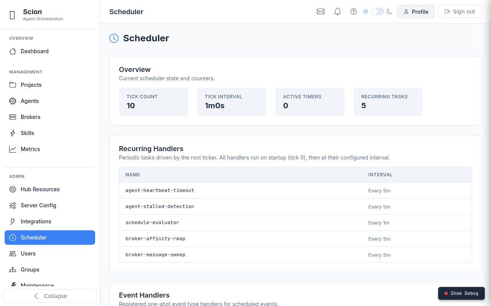

### Maintenance

**Maintenance** toggles maintenance mode for the Hub and Web servers to facilitate safe
infrastructure updates and run data migrations.

## Authentication

The dashboard supports several authentication methods:

- **OAuth (Google/GitHub)** — for standard user access.
- **Development auto-login** (`--dev-auth`) — for local development, which auto-creates
  an admin session and bypasses OAuth.

See the [Authentication Guide](/scion/hosted/single-node/auth/) for setup instructions.

## Tips

- **Collapse the sidebar** (bottom-left) to maximize the working area.
- **Toggle dark mode** from the top bar.
- The **Debug** panel (bottom-right) streams live SSE events — useful when an agent
  isn't updating as expected.
- Most detail pages offer a **back** link/breadcrumb to their parent (project or agent).
